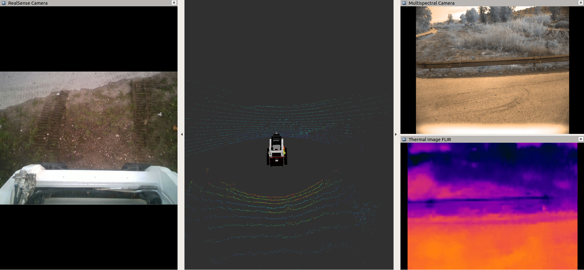
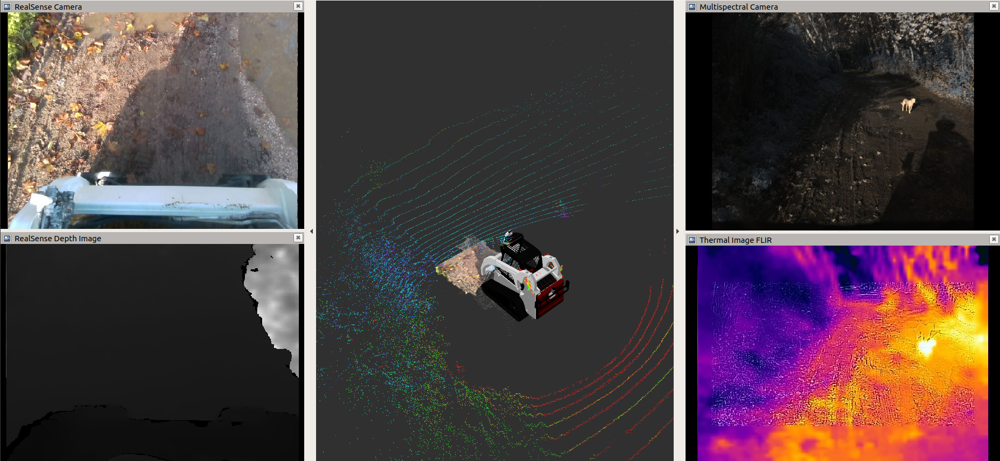
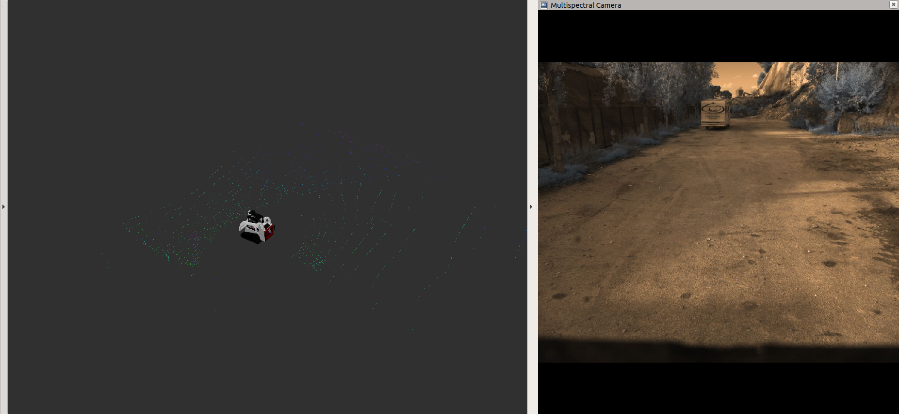
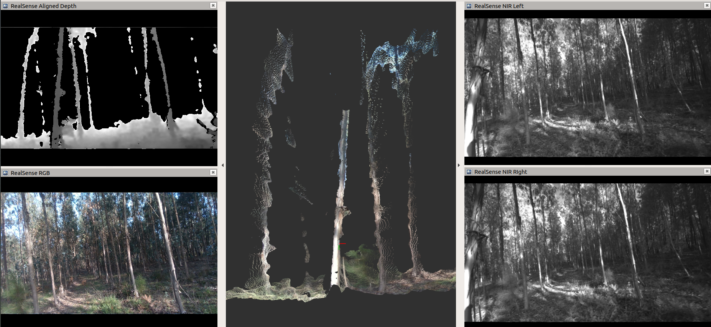

# FRUC ROS bags
## Version 0.1 (M. Eduarda Andrada)

## Overview

This package includes custom roslaunch and rviz files to launch [zenodo's dataset](https://zenodo.org/record/5751906#.YdRin9vLeV4) in labeled forests

**Keywords:** rosbags, zenodo, semfire

### :floppy_disk: :floppy_disk: :floppy_disk: Save bags from Zenodo *as is* to the folder /fruc_rosbags/rosbags/ :floppy_disk: :floppy_disk: :floppy_disk:

## Installation
### Dependencies
- Python 2.7/3.6
- [Robot Operating System (ROS) Melodic](http://wiki.ros.org)

### ROS Dependencies
Follow these steps to install all ROS dependencies 
```
# Create catkin space if it has not been created yet
mkdir -p ~/catkin_ws/src 
cd ~/catkin_ws/src/
# Clone this repository and lslidar repository
git clone git@github.com:Forestry-Robotics-UC/lslidar_c16.git
git clone git@github.com:Forestry-Robotics-UC/fruc_rosbags.git
# Install all missing dependencies 
rosdep install --from-paths . --ignore-src -y -r
# Start catkin workspace
cd ~/catkin_ws
catkin_make
```


## 2019/2020 Quinta do Bolao Coimbra
### Rviz custom configuration
Quinta do Bolao Part1


Quinta do Bolao Part2


### Launch Files
```
roslaunch fruc_rosbags 2019_2020_quinta_do_bolao_coimbra_part1.launch
roslaunch fruc_rosbags 2019_2020_quinta_do_bolao_coimbra_part2.launch
```

## 2020 CTCV Parking Lot Coimbra
### Rviz custom configuration

### Launch Files
```
roslaunch fruc_rosbags 2020_ctcv_parking_lot_coimbra.launch 
```

## 2020 Sete Fontes Forest
### Rviz custom configuration

### Launch Files
```
roslaunch fruc_rosbags 2020_sete_fontes_forest.launch
```